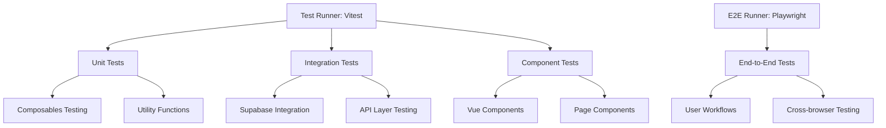

# Design Document

## Overview

The testing framework for High Notes will provide comprehensive test coverage across three layers: unit tests for individual components and composables, integration tests for Supabase interactions, and end-to-end tests for complete user workflows. The framework will use modern testing tools that integrate seamlessly with the existing Nuxt 3 + Vue 3 + TypeScript stack.

## Architecture

### Testing Stack Selection

**Primary Testing Framework: Vitest**
- Native Vite integration (Nuxt 3 uses Vite under the hood)
- Fast execution with hot module replacement
- TypeScript support out of the box
- Compatible with Jest API for easy migration
- Excellent Vue 3 support

**Component Testing: Vue Testing Library + Vitest**
- User-centric testing approach (queries by text, role, label)
- Encourages testing behavior over implementation
- Excellent TypeScript support
- Integrates well with Vitest

**End-to-End Testing: Playwright**
- Already configured in the project
- Cross-browser testing capabilities
- Reliable and fast execution
- Built-in test isolation

**Supabase Testing: Vitest + Mock Service Worker (MSW)**
- Mock Supabase API calls for unit/integration tests
- Real database testing for critical flows
- Environment-based test data management

### Test Environment Configuration



## Components and Interfaces

### 1. Test Configuration Layer

**vitest.config.ts**
- Main Vitest configuration
- Environment setup (jsdom for DOM testing)
- Path aliases matching Nuxt configuration
- Test file patterns and exclusions
- Coverage configuration

**playwright.config.ts** (existing, to be enhanced)
- Browser configurations
- Test data setup/teardown
- Environment-specific settings

### 2. Test Utilities Layer

**test-utils.ts**
- Custom render function for Vue components
- Nuxt context providers (router, plugins, etc.)
- Common test setup and teardown utilities
- Mock factories for common objects

**supabase-test-utils.ts**
- Supabase client mocking utilities
- Test database setup/teardown
- Authentication state mocking
- Real-time subscription mocking

**fixtures/index.ts**
- Test data fixtures
- User account fixtures
- Note content fixtures
- Database state fixtures

### 3. Mock Layer

**mocks/supabase.ts**
- Supabase client mock implementation
- Database operation mocks
- Authentication flow mocks
- Real-time subscription mocks

**mocks/nuxt.ts**
- Nuxt runtime mocks
- Router mocks
- Plugin mocks
- Server-side rendering mocks

### 4. Test Organization

```
tests/
├── unit/
│   ├── composables/
│   │   ├── useAuth.test.ts
│   │   ├── useNotes.test.ts
│   │   ├── useSupabase.test.ts
│   │   └── useLayout.test.ts
│   └── utils/
│       └── helpers.test.ts
├── integration/
│   ├── supabase/
│   │   ├── auth.test.ts
│   │   ├── notes-crud.test.ts
│   │   └── realtime.test.ts
│   └── api/
│       └── endpoints.test.ts
├── component/
│   ├── AppHeader.test.ts
│   └── pages/
│       ├── login.test.ts
│       ├── signup.test.ts
│       └── notes.test.ts
├── e2e/
│   ├── auth-flow.spec.ts
│   ├── notes-management.spec.ts
│   └── responsive-design.spec.ts
├── fixtures/
│   ├── users.ts
│   ├── notes.ts
│   └── database-states.ts
├── mocks/
│   ├── supabase.ts
│   └── nuxt.ts
└── utils/
    ├── test-utils.ts
    ├── supabase-test-utils.ts
    └── setup.ts
```

## Data Models

### Test Data Models

**User Fixture**
```typescript
interface TestUser {
  id: string
  email: string
  password: string
  created_at: string
  email_confirmed_at?: string
}
```

**Note Fixture**
```typescript
interface TestNote {
  id: string
  user_id: string
  title: string
  content: string
  created_at: string
  updated_at: string
}
```

**Test Database State**
```typescript
interface TestDatabaseState {
  users: TestUser[]
  notes: TestNote[]
  auth_sessions?: any[]
}
```

### Mock Response Models

**Supabase Response Mock**
```typescript
interface MockSupabaseResponse<T> {
  data: T | null
  error: PostgrestError | null
  status: number
  statusText: string
}
```

## Error Handling

### Test Error Categories

1. **Assertion Errors**: Clear messages about what was expected vs actual
2. **Setup Errors**: Database connection, mock configuration issues
3. **Timeout Errors**: Async operations that don't complete
4. **Environment Errors**: Missing environment variables, configuration issues

### Error Reporting Strategy

- **Unit Tests**: Fast failure with detailed error messages
- **Integration Tests**: Retry logic for flaky network operations
- **E2E Tests**: Screenshot capture on failure
- **Coverage Reports**: Fail build if coverage drops below threshold

### Mock Error Simulation

```typescript
// Simulate network errors
mockSupabase.auth.signIn.mockRejectedValue(new Error('Network error'))

// Simulate validation errors
mockSupabase.from('notes').insert.mockResolvedValue({
  data: null,
  error: { message: 'Validation failed', code: '23505' }
})
```

## Testing Strategy

### Unit Testing Approach

**Composables Testing**
- Test all public methods and reactive state
- Mock external dependencies (Supabase, router)
- Test error handling and edge cases
- Verify reactive updates and side effects

**Component Testing**
- Render components with required props/context
- Test user interactions (clicks, form submissions)
- Verify conditional rendering and state changes
- Test accessibility features

### Integration Testing Approach

**Supabase Integration**
- Test actual database operations in isolated environment
- Verify authentication flows
- Test real-time subscriptions
- Validate data transformations

**API Layer Testing**
- Test server-side API routes
- Verify request/response handling
- Test authentication middleware
- Validate error responses

### End-to-End Testing Approach

**Critical User Flows**
- Complete authentication journey
- Note creation, editing, deletion workflow
- Search and filtering functionality
- Responsive design across devices

**Cross-Browser Testing**
- Chrome, Firefox, Safari compatibility
- Mobile viewport testing
- Progressive Web App features

## Testing Strategy

### Test Data Management

**Development Database**
- Separate Supabase project for testing
- Automated database seeding
- Isolated test user accounts
- Cleanup after test runs

**Mock Data Strategy**
- Realistic test data that matches production patterns
- Consistent data across test runs
- Edge case data (empty states, large datasets)
- Internationalization test data

### Performance Testing

**Load Testing Considerations**
- Database query performance
- Component rendering performance
- Bundle size impact of test utilities
- Memory usage during test runs

### Continuous Integration

**GitHub Actions Integration**
- Run tests on pull requests
- Parallel test execution
- Coverage reporting
- E2E tests on staging environment

**Test Environment Management**
- Separate test database per PR
- Environment variable management
- Test data isolation
- Cleanup automation